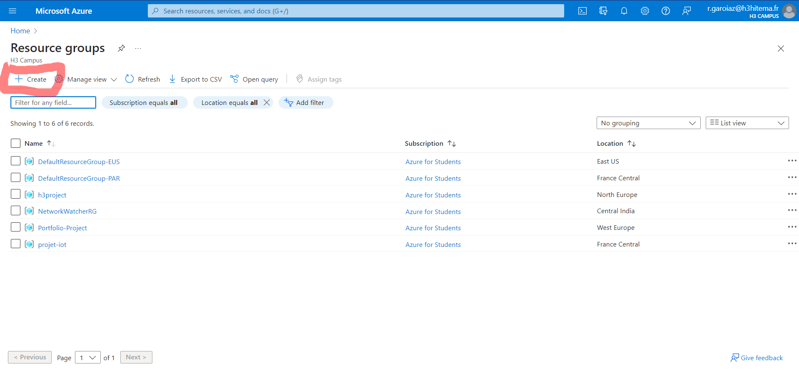

# Ceate a Virtual Machine (VM)

La création d'une machine virtuelle (VM) sur le portail Azure implique plusieurs étapes. Voici un guide étape par étape pour créer une VM sur le portail Azure :

1. **Connexion à Azure :** Connectez-vous à votre compte Azure sur le portail Azure à l'adresse suivante : [https://portal.azure.com/](https://portal.azure.com/).

2. **Navigation vers le service "Machines virtuelles" :** Dans le portail Azure, cliquez sur "Créer une ressource" dans le menu de gauche, puis recherchez et sélectionnez "Machine virtuelle".

3. **Configuration de base :** Remplissez les informations de base pour la machine virtuelle, telles que le nom de la machine virtuelle, le système d'exploitation, le groupe de ressources, la région, etc.

4. **Choix de l'image :** Sélectionnez l'image du système d'exploitation que vous souhaitez utiliser. Azure propose plusieurs images préconfigurées pour différents systèmes d'exploitation.

5. **Taille de la machine virtuelle :** Choisissez la taille de la machine virtuelle en fonction de vos besoins en termes de performances et de ressources. Azure propose différents types de tailles de machines virtuelles.

6. **Configuration des paramètres facultatifs :** Configurez d'autres paramètres facultatifs tels que le stockage, le réseau, l'extension de script, etc. Ces options dépendent de vos besoins spécifiques.

7. **Sécurité et accès :** Configurez les règles de pare-feu et les règles de réseau selon vos besoins en matière de sécurité. Vous pouvez également définir des clés SSH ou des mots de passe pour l'authentification.

8. **Disques :** Configurez les disques pour votre machine virtuelle, y compris le disque de système d'exploitation et d'autres disques de données si nécessaire.

9. **Vérification et création :** Passez en revue toutes les configurations que vous avez définies, puis cliquez sur le bouton "Vérifier + créer" pour valider la configuration.

10. **Validation et déploiement :** Azure effectuera une validation de votre configuration. Si la validation réussit, cliquez sur "Créer" pour déployer la machine virtuelle.

11. **Suivi du déploiement :** Une fois la machine virtuelle créée, vous pouvez suivre le déploiement dans le portail Azure. Une fois le déploiement terminé, vous pouvez accéder à votre machine virtuelle.


# Set Up Blob Storage

La création d'un compte de stockage Azure avec un conteneur Blob Storage peut être réalisée en suivant ces étapes sur le portail Azure :

1. **Connexion à Azure :** Connectez-vous à votre compte Azure sur le portail Azure à l'adresse [https://portal.azure.com/](https://portal.azure.com/).

2. **Navigation vers le service "Stockage" :** Dans le portail Azure, cliquez sur "Créer une ressource" dans le menu de gauche, puis recherchez et sélectionnez "Stockage" dans la section "Tous les services". Vous pouvez également trouver le service en naviguant directement vers "Tous les services" > "Stockage".

3. **Création d'un compte de stockage :**
   - Cliquez sur le bouton "+ Ajouter" pour créer un nouveau compte de stockage.
   - Remplissez les informations nécessaires comme le nom du compte de stockage, le modèle de déploiement, le groupe de ressources, la région, et choisissez le type de réplication de données (Localement Redondant, Géoredondant, etc.).

4. **Configuration avancée (facultative) :** Vous pouvez configurer des options avancées telles que les paramètres réseau, les tags, la gestion avancée, etc. Ces options sont facultatives et peuvent être laissées par défaut si vous n'avez pas de besoins spécifiques.

5. **Vérification et création :** Passez en revue toutes les configurations que vous avez définies, puis cliquez sur le bouton "Vérifier + créer" pour valider la configuration.

6. **Validation et déploiement :** Azure effectuera une validation de votre configuration. Si la validation réussit, cliquez sur "Créer" pour déployer le compte de stockage.

7. **Accéder au compte de stockage :** Une fois le déploiement terminé, accédez au compte de stockage nouvellement créé. Vous pouvez le trouver dans le portail Azure en naviguant vers "Tous les services" > "Stockage" > [Nom du compte de stockage].

8. **Création d'un conteneur Blob Storage :**
   - Dans la section du compte de stockage, cliquez sur "Conteneurs" dans le menu de gauche.
   - Cliquez sur le bouton "+ Conteneur" pour créer un nouveau conteneur Blob Storage.
   - Donnez un nom unique au conteneur, choisissez l'accès public (privé ou public en lecture) et configurez d'autres options si nécessaire.

9. **Validation et déploiement du conteneur :** Passez en revue les configurations du conteneur, puis cliquez sur "OK" pour créer le conteneur.

10. **Accès au conteneur :** Une fois le conteneur créé, vous pouvez y accéder et commencer à stocker des blobs (objets) dans le stockage.


# Deploy a Web App

Le déploiement d'une application web sur Azure peut être réalisé en suivant ces étapes générales sur le portail Azure :

1. **Connexion à Azure :** Connectez-vous à votre compte Azure sur le portail Azure à l'adresse [https://portal.azure.com/](https://portal.azure.com/).

2. **Navigation vers le service "App Service" :** Dans le portail Azure, cliquez sur "Créer une ressource" dans le menu de gauche, puis recherchez et sélectionnez "App Service" dans la section "Tous les services". Vous pouvez également trouver le service en naviguant directement vers "Tous les services" > "App Service".

3. **Création d'un nouvel App Service :**
   - Cliquez sur le bouton "+ Ajouter" pour créer un nouvel App Service.
   - Remplissez les informations nécessaires, telles que le nom de l'App Service, le modèle de déploiement, le groupe de ressources, la région, le système d'exploitation, etc.

4. **Configuration de l'hébergement :**
   - Choisissez un plan tarifaire (tarification de l'App Service) en fonction de vos besoins.
   - Configurez d'autres paramètres tels que la pile d'exécution (Node.js, .NET, Python, etc.) et la version de runtime.

5. **Configuration des paramètres avancés (facultatif) :** Configurez des options avancées telles que la mise à l'échelle automatique, la gestion des paramètres, les règles d'arrêt automatique, etc. Ces options sont facultatives et peuvent être ajustées en fonction de vos besoins spécifiques.

6. **Vérification et création :** Passez en revue toutes les configurations que vous avez définies, puis cliquez sur le bouton "Vérifier + créer" pour valider la configuration.

7. **Validation et déploiement :** Azure effectuera une validation de votre configuration. Si la validation réussit, cliquez sur "Créer" pour déployer l'App Service.

8. **Accès à l'App Service :** Une fois le déploiement terminé, accédez à votre App Service depuis le portail Azure en naviguant vers "Tous les services" > "App Services" > [Nom de l'App Service].

9. **Déploiement de l'application :**
   - Dans la section de votre App Service, cliquez sur "Déploiements" dans le menu de gauche.
   - Sélectionnez la méthode de déploiement souhaitée, comme le déploiement continu depuis un référentiel Git, un référentiel Azure DevOps, ou le déploiement manuel.

10. **Suivi du déploiement :** Suivez le processus de déploiement dans la section "Déploiements" pour vous assurer que votre application est correctement déployée.


# Create a SQL Database

La création d'une base de données SQL sur Azure peut être réalisée en suivant ces étapes générales sur le portail Azure :

1. **Connexion à Azure :** Connectez-vous à votre compte Azure sur le portail Azure à l'adresse [https://portal.azure.com/](https://portal.azure.com/).

2. **Navigation vers le service "Bases de données SQL" :** Dans le portail Azure, cliquez sur "Créer une ressource" dans le menu de gauche, puis recherchez et sélectionnez "Bases de données SQL" dans la section "Tous les services". Vous pouvez également trouver le service en naviguant directement vers "Tous les services" > "Bases de données SQL".

3. **Création d'une nouvelle base de données SQL :**
   - Cliquez sur le bouton "+ Ajouter" pour créer une nouvelle base de données SQL.
   - Remplissez les informations nécessaires, telles que le nom de la base de données, le modèle de déploiement, le groupe de ressources, la région, le serveur SQL, etc.

4. **Configuration du serveur SQL :**
   - Si vous n'avez pas encore de serveur SQL, créez-en un en spécifiant un nom unique, un nom d'administrateur et un mot de passe.
   - Configurez d'autres paramètres du serveur, tels que la version du serveur, la capacité, etc.

5. **Configuration des paramètres avancés (facultatif) :** Configurez des options avancées telles que la sécurité avancée, la rétention automatique, etc. Ces options sont facultatives et peuvent être ajustées en fonction de vos besoins spécifiques.

6. **Configuration des règles pare-feu :** Configurez les règles pare-feu pour spécifier quels clients peuvent accéder à votre base de données SQL. Vous pouvez autoriser l'accès à partir d'une plage d'adresses IP spécifique.

7. **Vérification et création :** Passez en revue toutes les configurations que vous avez définies, puis cliquez sur le bouton "Vérifier + créer" pour valider la configuration.

8. **Validation et déploiement :** Azure effectuera une validation de votre configuration. Si la validation réussit, cliquez sur "Créer" pour déployer la base de données SQL.

9. **Accès à la base de données :** Une fois le déploiement terminé, accédez à votre base de données SQL depuis le portail Azure en naviguant vers "Tous les services" > "Bases de données SQL" > [Nom de la base de données].

10. **Gestion de la base de données :** Vous pouvez gérer votre base de données, y compris la configuration, la surveillance, et l'exécution de requêtes SQL, depuis le portail Azure.


# Implement a simple Azure Functions

La création d'une fonction Azure sur le portail Azure peut être réalisée en suivant ces étapes générales :

1. **Connexion à Azure :** Connectez-vous à votre compte Azure sur le portail Azure à l'adresse [https://portal.azure.com/](https://portal.azure.com/).

2. **Navigation vers le service "Functions App" :** Dans le portail Azure, cliquez sur "Créer une ressource" dans le menu de gauche, puis recherchez et sélectionnez "Functions App" dans la section "Tous les services". Vous pouvez également trouver le service en naviguant directement vers "Tous les services" > "Functions App".

3. **Création d'une nouvelle Functions App :**
   - Cliquez sur le bouton "+ Ajouter" pour créer une nouvelle Functions App.
   - Remplissez les informations nécessaires, telles que le nom de l'application, le modèle de déploiement, le groupe de ressources, la région, etc.

4. **Configuration des paramètres avancés (facultatif) :** Configurez des options avancées telles que la version du runtime, le système d'exploitation, le plan tarifaire, etc. Ces options sont facultatives et peuvent être ajustées en fonction de vos besoins spécifiques.

5. **Configuration de la surveillance (facultatif) :** Vous pouvez activer la surveillance pour collecter des données de télémétrie sur les performances de votre Functions App. Cela est facultatif mais peut être utile pour le suivi et le débogage.

6. **Vérification et création :** Passez en revue toutes les configurations que vous avez définies, puis cliquez sur le bouton "Vérifier + créer" pour valider la configuration.

7. **Validation et déploiement :** Azure effectuera une validation de votre configuration. Si la validation réussit, cliquez sur "Créer" pour déployer la Functions App.

8. **Accès à la Functions App :** Une fois le déploiement terminé, accédez à votre Functions App depuis le portail Azure en naviguant vers "Tous les services" > "Functions Apps" > [Nom de l'application].

9. **Ajout d'une fonction :**
   - Dans la section de votre Functions App, cliquez sur "Ajouter une fonction" dans le menu de gauche.
   - Sélectionnez le modèle de fonction que vous souhaitez utiliser, tel que HTTP trigger, Timer trigger, etc.

10. **Configuration de la fonction :**
    - Remplissez les informations nécessaires spécifiques à la fonction que vous ajoutez, comme le nom, l'autorisation, etc.
    - Cliquez sur "Ajouter" pour créer la fonction.

11. **Test de la fonction :**
    - Après avoir ajouté la fonction, vous pouvez tester son exécution en utilisant l'interface du portail Azure.


# Set Up a Networking ressource

La configuration des ressources réseau sur le portail Azure implique plusieurs étapes, notamment la création de réseaux virtuels, de groupes de sécurité réseau, de sous-réseaux, etc. Voici une procédure générale pour configurer des ressources réseau sur le portail Azure :

1. **Connexion à Azure :** Connectez-vous à votre compte Azure sur le portail Azure à [https://portal.azure.com/](https://portal.azure.com/).

2. **Navigation vers le service "Réseaux" :** Dans le portail Azure, cliquez sur "Créer une ressource" dans le menu de gauche, puis recherchez et sélectionnez "Réseaux" dans la section "Tous les services". Vous pouvez également naviguer directement vers "Tous les services" > "Réseaux".

3. **Création d'un réseau virtuel (VNet) :**
   - Cliquez sur le bouton "+ Ajouter" pour créer un nouveau réseau virtuel.
   - Remplissez les informations nécessaires, telles que le nom du VNet, le groupe de ressources, la région, l'espace d'adressage IP, etc.

4. **Configuration des sous-réseaux :** Lors de la création du VNet, vous pouvez également ajouter des sous-réseaux en spécifiant leurs noms et plages d'adresses IP.

5. **Création de groupes de sécurité réseau (NSG) :**
   - Dans la section de votre VNet, cliquez sur "Groupes de sécurité réseau" dans le menu de gauche.
   - Cliquez sur le bouton "+ Ajouter" pour créer un nouveau groupe de sécurité réseau.
   - Remplissez les informations nécessaires, telles que le nom, le groupe de ressources, la région, etc.

6. **Configuration des règles de sécurité :** Dans le groupe de sécurité réseau, configurez les règles de sécurité entrantes et sortantes pour contrôler le trafic réseau autorisé.

7. **Création de règles de routage (facultatif) :** Si vous avez besoin de configurer des règles de routage personnalisées, vous pouvez le faire dans la section "Routage" de votre VNet.

8. **Vérification et création :** Passez en revue toutes les configurations que vous avez définies, puis cliquez sur le bouton "Vérifier + créer" pour valider la configuration.

9. **Validation et déploiement :** Azure effectuera une validation de votre configuration. Si la validation réussit, cliquez sur "Créer" pour déployer le VNet et les autres ressources réseau.

10. **Accès aux ressources réseau :** Une fois le déploiement terminé, accédez à vos ressources réseau depuis le portail Azure en naviguant vers "Tous les services" > "Réseaux" > [Nom du réseau virtuel, groupe de sécurité réseau, etc.].


# Configure Monitoring and Logging

La configuration de la surveillance (monitoring) et de la journalisation (logging) des coûts sur Azure peut être réalisée en suivant ces étapes générales :

1. **Connexion à Azure :** Connectez-vous à votre compte Azure sur le portail Azure à [https://portal.azure.com/](https://portal.azure.com/).

2. **Navigation vers le service "Facturation et coûts" :** Dans le portail Azure, cliquez sur "Créer une ressource" dans le menu de gauche, puis recherchez et sélectionnez "Facturation et coûts" dans la section "Tous les services". Vous pouvez également naviguer directement vers "Tous les services" > "Facturation + Coûts".

3. **Configuration des alertes budgétaires (facultatif) :**
   - Dans la section "Facturation + Coûts", cliquez sur "Alertes budgétaires" dans le menu de gauche.
   - Cliquez sur "Configurer une alerte budgétaire" pour créer une alerte sur les dépenses.

4. **Configuration des budgets :**
   - Définissez les détails du budget, tels que le nom, la plage de dates, le montant du budget, etc.
   - Configurez les alertes pour être informé lorsque les dépenses atteignent ou dépassent un seuil défini.

5. **Configuration des journaux d'activité (logs) :**
   - Dans la section "Facturation + Coûts", cliquez sur "Journaux d'activité" dans le menu de gauche.
   - Activez les journaux d'activité Azure pour collecter des informations détaillées sur les opérations effectuées dans votre abonnement.

6. **Configuration de la journalisation de l'utilisation :**
   - Cliquez sur "Journalisation de l'utilisation" dans la section "Facturation + Coûts".
   - Activez la journalisation de l'utilisation pour collecter des données détaillées sur l'utilisation des services.

7. **Configuration des rapports d'utilisation (facultatif) :**
   - Dans la section "Facturation + Coûts", cliquez sur "Rapports d'utilisation" dans le menu de gauche.
   - Configurez des rapports personnalisés pour obtenir des informations détaillées sur l'utilisation et les coûts.

8. **Vérification et création :** Passez en revue toutes les configurations que vous avez définies, puis cliquez sur le bouton "Vérifier + créer" pour valider la configuration.

9. **Validation et déploiement :** Azure effectuera une validation de votre configuration. Si la validation réussit, cliquez sur "Créer" pour déployer la configuration de surveillance et de journalisation des coûts.

10. **Accès aux rapports et aux données de surveillance :**
    - Une fois le déploiement terminé, accédez aux rapports et aux données de surveillance depuis la section "Facturation + Coûts" dans le portail Azure.


# Implement Azure Identity by creating a simple dev role

Cela implique généralement la création d'une identité managée (Managed Identity) et peut également inclure l'attribution de ce rôle à des ressources spécifiques. Voici une approche générale pour implémenter une identité Azure et lui attribuer un rôle de développeur :

1. **Connexion à Azure :** Connectez-vous à votre compte Azure sur le portail Azure à [https://portal.azure.com/](https://portal.azure.com/).

2. **Création d'une identité managée :**
   - Dans le portail Azure, accédez à la ressource à laquelle vous souhaitez attribuer l'identité (par exemple, une machine virtuelle, une fonction, etc.).
   - Recherchez l'onglet "Identité" dans le panneau de configuration de la ressource.
   - Activez l'identité managée en le configurant sur "Activé" et enregistrez les modifications.

3. **Attribution d'un rôle au développeur :**
   - Dans le portail Azure, accédez à la ressource à laquelle vous avez activé l'identité managée.
   - Recherchez l'onglet "Contrôle d'accès (IAM)" dans le panneau de configuration de la ressource.
   - Cliquez sur "Ajouter un rôle d'accès" et recherchez le rôle approprié pour les développeurs, par exemple, "Contributeur" qui permet de gérer tous les aspects de la ressource.

4. **Sélection de l'utilisateur ou du groupe :**
   - Ajoutez le nom d'utilisateur ou le groupe d'utilisateurs auquel vous souhaitez accorder ce rôle.
   - Vous pouvez sélectionner un utilisateur spécifique, un groupe Azure AD ou même un groupe d'utilisateurs externe si nécessaire.

5. **Validation et ajout du rôle :**
   - Passez en revue toutes les configurations que vous avez définies, puis cliquez sur le bouton "Ajouter" pour attribuer le rôle au développeur.

6. **Test de l'identité managée :**
   - Une fois l'identité managée activée et le rôle attribué, vous pouvez tester son fonctionnement en utilisant l'identité managée pour accéder à des ressources Azure (par exemple, en utilisant l'identité managée pour accéder à une base de données Azure).


# Create a personalized Resource Group

1. **Connexion à Azure :** Connectez-vous à votre compte Azure sur le portail Azure à [https://portal.azure.com/](https://portal.azure.com/).

2. **Navigation vers le service "Groupes de ressources" :** Dans le portail Azure, cliquez sur "Créer une ressource" dans le menu de gauche, puis recherchez et sélectionnez "Groupes de ressources" dans la section "Tous les services". Vous pouvez également naviguer directement vers "Tous les services" > "Groupes de ressources".

3. **Création d'un nouveau groupe de ressources :**
   - Cliquez sur le bouton "+ Ajouter" pour créer un nouveau groupe de ressources.
   - Remplissez les informations nécessaires, telles que le nom du groupe de ressources, le modèle de déploiement, la région, etc.

4. **Vérification et création :** Passez en revue toutes les configurations que vous avez définies, puis cliquez sur le bouton "Vérifier + créer" pour valider la configuration.

5. **Validation et déploiement :** Azure effectuera une validation de votre configuration. Si la validation réussit, cliquez sur "Créer" pour déployer le groupe de ressources.

6. **Accès au groupe de ressources :** Une fois le déploiement terminé, accédez à votre groupe de ressources depuis le portail Azure en naviguant vers "Tous les services" > "Groupes de ressources" > [Nom du groupe de ressources].




```python
import foobar

# returns 'words'
foobar.pluralize('word')

# returns 'geese'
foobar.pluralize('goose')

# returns 'phenomenon'
foobar.singularize('phenomena')
```

## Contributing

Pull requests are welcome. For major changes, please open an issue first
to discuss what you would like to change.

Please make sure to update tests as appropriate.

## License

[MIT](https://choosealicense.com/licenses/mit/)
