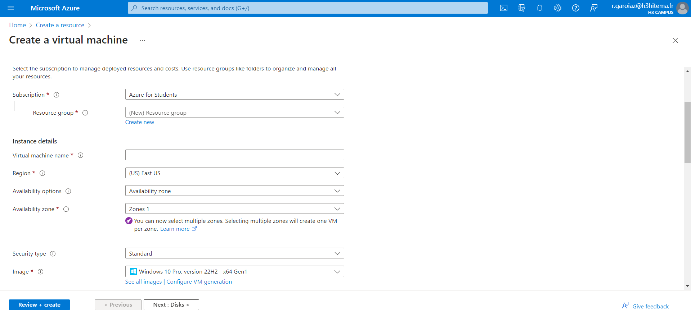

# Ceate a Virtual Machine (VM)

La création d'une machine virtuelle (VM) sur le portail Azure implique plusieurs étapes. Voici un guide étape par étape pour créer une VM sur le portail Azure :

1. **Connexion à Azure :** Connectez-vous à votre compte Azure sur le portail Azure à l'adresse suivante : [https://portal.azure.com/](https://portal.azure.com/).

2. **Navigation vers le service "Machines virtuelles" :** Dans le portail Azure, cliquez sur "Créer une ressource" dans le menu de gauche, puis recherchez et sélectionnez "Machine virtuelle".

3. **Configuration de base :** Remplissez les informations de base pour la machine virtuelle, telles que le nom de la machine virtuelle, le système d'exploitation, le groupe de ressources, la région, etc.

4. **Choix de l'image :** Sélectionnez l'image du système d'exploitation que vous souhaitez utiliser. Azure propose plusieurs images préconfigurées pour différents systèmes d'exploitation.

5. **Taille de la machine virtuelle :** Choisissez la taille de la machine virtuelle en fonction de vos besoins en termes de performances et de ressources. Azure propose différents types de tailles de machines virtuelles.

6. **Configuration des paramètres facultatifs :** Configurez d'autres paramètres facultatifs tels que le stockage, le réseau, l'extension de script, etc. Ces options dépendent de vos besoins spécifiques.

7. **Sécurité et accès :** Configurez les règles de pare-feu et les règles de réseau selon vos besoins en matière de sécurité. Vous pouvez également définir des clés SSH ou des mots de passe pour l'authentification.

8. **Disques :** Configurez les disques pour votre machine virtuelle, y compris le disque de système d'exploitation et d'autres disques de données si nécessaire.

9. **Vérification et création :** Passez en revue toutes les configurations que vous avez définies, puis cliquez sur le bouton "Vérifier + créer" pour valider la configuration.

10. **Validation et déploiement :** Azure effectuera une validation de votre configuration. Si la validation réussit, cliquez sur "Créer" pour déployer la machine virtuelle.

11. **Suivi du déploiement :** Une fois la machine virtuelle créée, vous pouvez suivre le déploiement dans le portail Azure. Une fois le déploiement terminé, vous pouvez accéder à votre machine virtuelle.





## Installation

Use the package manager [pip](https://pip.pypa.io/en/stable/) to install foobar.

```bash
pip install foobar
```

## Usage

```python
import foobar

# returns 'words'
foobar.pluralize('word')

# returns 'geese'
foobar.pluralize('goose')

# returns 'phenomenon'
foobar.singularize('phenomena')
```

## Contributing

Pull requests are welcome. For major changes, please open an issue first
to discuss what you would like to change.

Please make sure to update tests as appropriate.

## License

[MIT](https://choosealicense.com/licenses/mit/)
