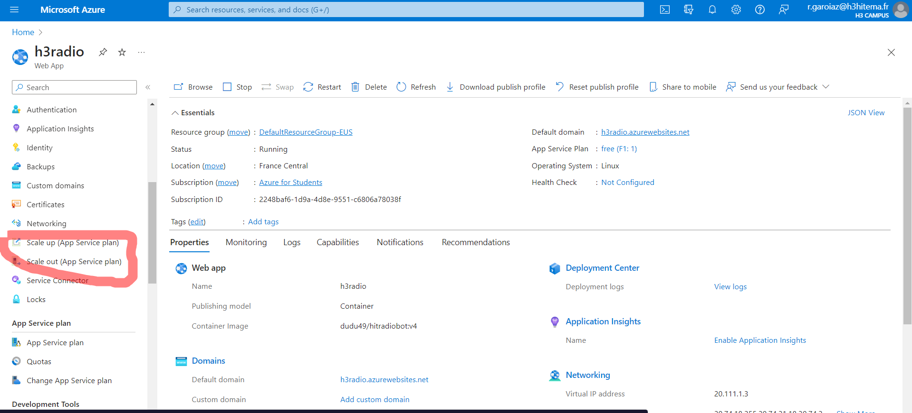
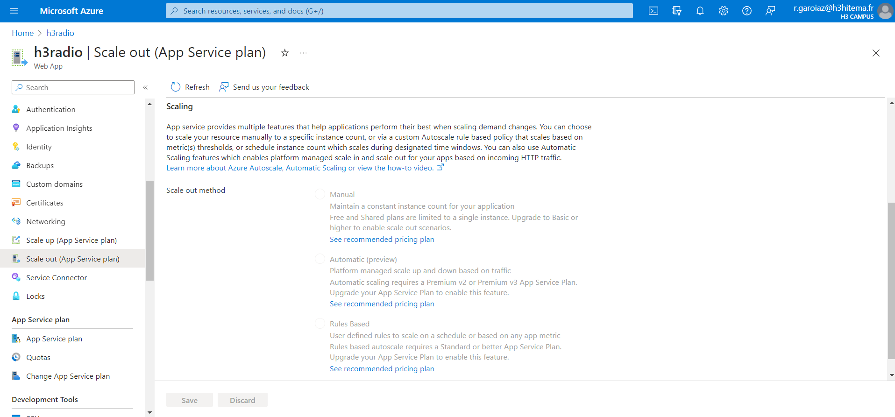

# Set Up Auto-Scaling

La mise en place du redimensionnement automatique (Auto-Scaling) sur Azure dépend du service que vous utilisez. Voici une procédure générale qui couvre la mise en place du redimensionnement automatique pour une application hébergée dans un service Azure App Service (par exemple, des applications Web) :

1. **Connexion à Azure :** Connectez-vous à votre compte Azure sur le portail Azure à [https://portal.azure.com/](https://portal.azure.com/).

2. **Navigation vers le service App Service :** Dans le portail Azure, cliquez sur "Créer une ressource" dans le menu de gauche, puis recherchez et sélectionnez "App Service" dans la section "Tous les services". Vous pouvez également naviguer directement vers "Tous les services" > "App Service".

3. **Accès à l'App Service :** Accédez à votre application App Service depuis le portail Azure en naviguant vers "Tous les services" > "App Services" > [Nom de l'App Service].

4. **Configuration du redimensionnement automatique :**
   - Dans la section de votre App Service, cliquez sur "Mise à l'échelle" dans le menu de gauche.
   - Activez l'option "Mise à l'échelle automatique".
   - Configurez les règles de redimensionnement automatique, telles que le nombre minimum et maximum d'instances, les seuils de CPU, la durée de stabilité, etc.

5. **Vérification et création :** Passez en revue toutes les configurations que vous avez définies, puis cliquez sur le bouton "Vérifier + créer" pour valider la configuration.

6. **Validation et déploiement :** Azure effectuera une validation de votre configuration. Si la validation réussit, cliquez sur "Créer" pour déployer la configuration de redimensionnement automatique.

7. **Suivi du redimensionnement automatique :** Une fois le déploiement terminé, vous pouvez suivre l'activité de redimensionnement automatique dans la section "Mise à l'échelle" de votre App Service.

