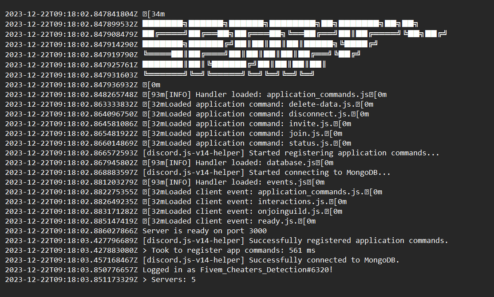
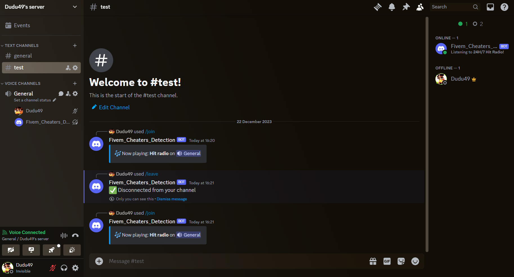
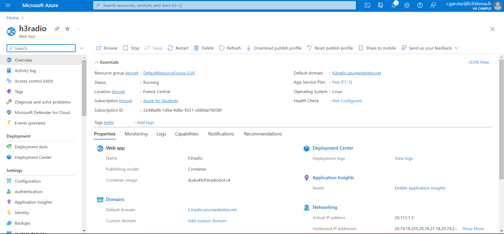

# Discord bot that interact with azure cosmosdb database 

My project is a Discord bot that I have successfully deployed on the cloud using an Azure App Service as a container. The deployment on the Azure App Service involves configuring the necessary settings, such as environment variables and dependencies, to ensure smooth operation.

To deploy the bot, I utilized Azure App Service's capabilities for containerized applications, taking advantage of the platform's scalability and reliability. The deployment process involved containerizing the bot, configuring the Azure App Service to host the container, and managing any required dependencies.

Furthermore, the Azure App Service provides a user-friendly interface for monitoring and managing the deployed application. This includes features such as automatic scaling to handle varying workloads, logging for troubleshooting, and integration with Azure DevOps or other CI/CD pipelines for seamless updates.

The bot's interaction with an Azure Cosmos DB database adds a robust data storage and retrieval layer to the project. The Cosmos DB integration allows for efficient handling of data, ensuring that the bot operates with up-to-date information and maintains a reliable connection to its data source.

In summary, my Discord bot project leverages the Azure App Service for containerized deployment, offering scalability, ease of management, and integration with Azure Cosmos DB for a comprehensive and efficient solution.

